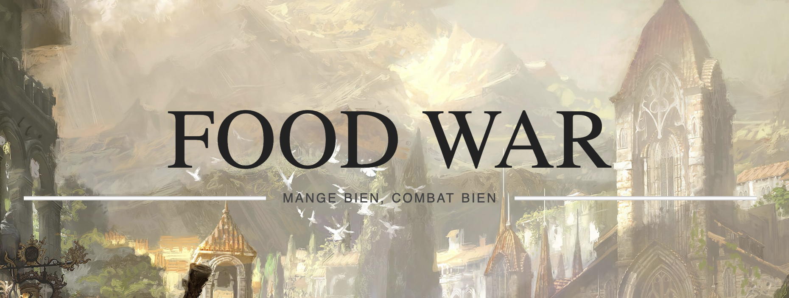
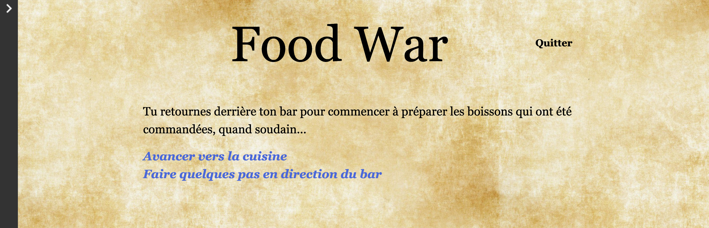

# 
#### Sébastien Franzone

# Description de la fiction interactive et de ses fonctionnalités
Une fiction interactive sur le thème de la santé, plus précisément sur la nourriture et ses bienfaits ou méfaits. Dans cette fiction interactive, vous incarnerez l'héritier ou héritière des tenants de la meilleure taverne du royaume. Vos parents sont partis à la retraite en vous léguant la fameuse taverne. Vous serez amené à faire des choix de plats pour nourrire le royaume et même les armées lorsqu'une guerre éclate.

Le but de cette fiction interactive sera de faire différencier aux personnes y jouant les bienfaits ou méfaits de la nourriture et à quoi ils sont dus. En effet, les personnes jouant à cette fiction interactive seront amenées à faire des choix de repas à servir, bons pour la santé ou non. Ils devront découvrir, en fonction des jauges de fibres, protéines, graisse et sel, qu'elles sont les meilleures combinaison pour que les soldats puissent combattre le mieux possible pour gagner leur guerre. (Cette dernière partie est encore en cours de travail pour la rendre plus facile à comprendre et plus équilibré). Si vous réussissez à faire en sorte que vos armées gagnent au moins 2 fois durant la journée avec la nourriture que vous leur serverez, vous réussirez à reporter la guerre et sauvez votre royaume !

# Game captures
- Exemple de choix donné dans la fiction interactive :

- Exemple avec les jauges de fibres, protéines, sel et graisses

# Procédure de téléchargement
1. Aller sur le [lien de téléchargement (itch.io)](https://tatsumakyy.itch.io/food-war/download/3ugLT7o5MnQXU7PS1hj1H9Q1BxVzseQeTOCNDz_H)
2. Télécharger le fichier .zip
3. Extraire les fichiers à un endroit
4. Lancer le fichier index.html

# Références
### Sons
- Les sons gratuits ont été téléchargés sur [chosic.com](https://www.chosic.com/free-music/all/) et [uppbeat.io/](https://uppbeat.io/)
### Images
- Image de l'écran titre : [wallpaperset.com/medieval-backgrounds](https://wallpaperset.com/medieval-backgrounds)
- Autres images générées à l'aide d'une Intelligence Artificielle : [playground.com](https://playground.com/)

# Contexte

Ce projet a été développé dans le cadre du cours "Fictions Interactives" dispensé par Isaac Pante (SLI, Lettres, UNIL) et n'est pas un produit fini. Des mises à jour seront à venir.

